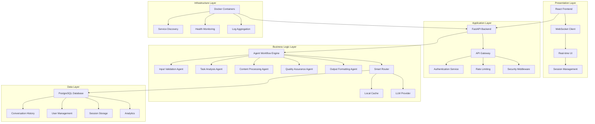
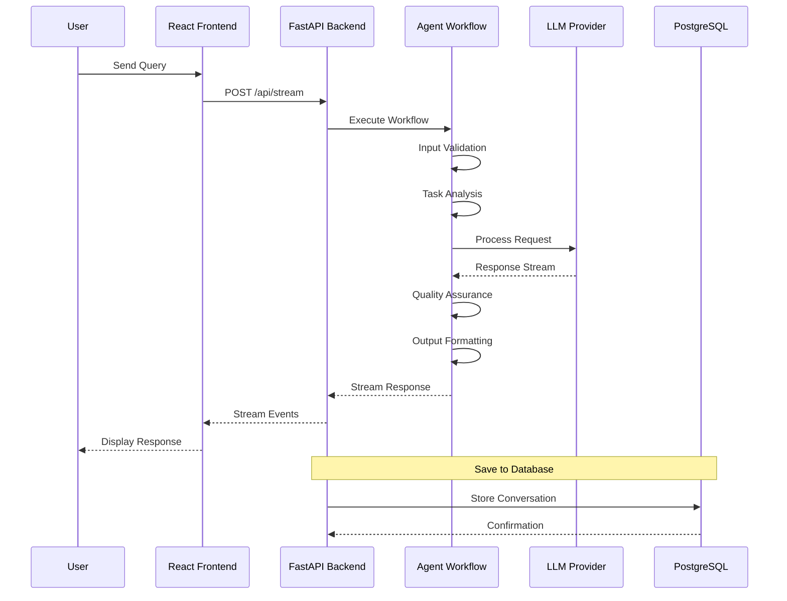
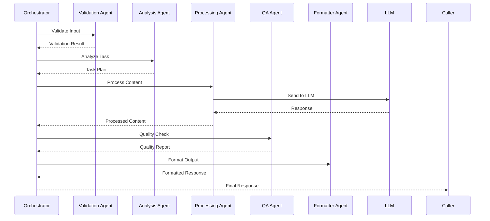
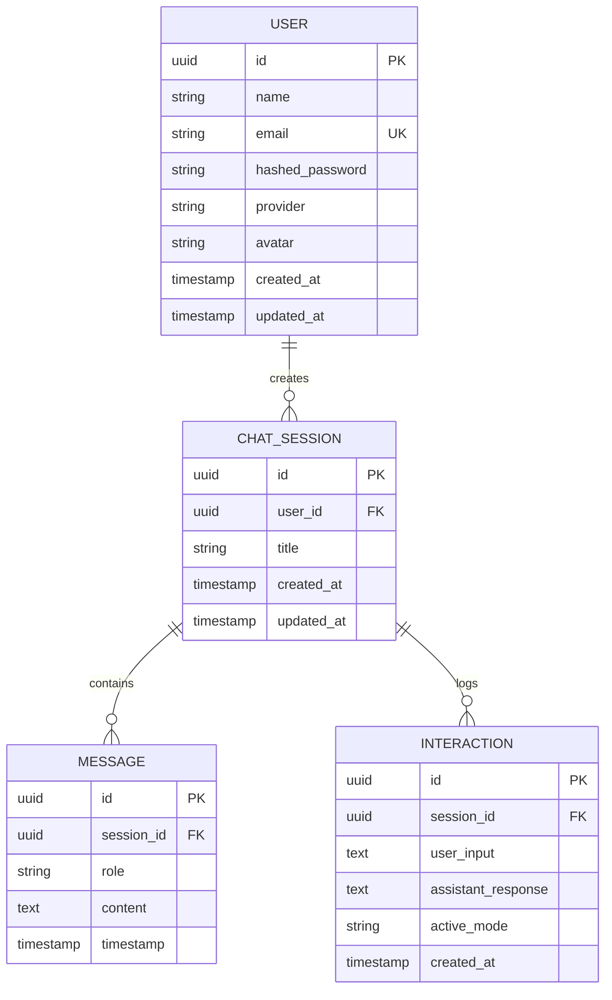
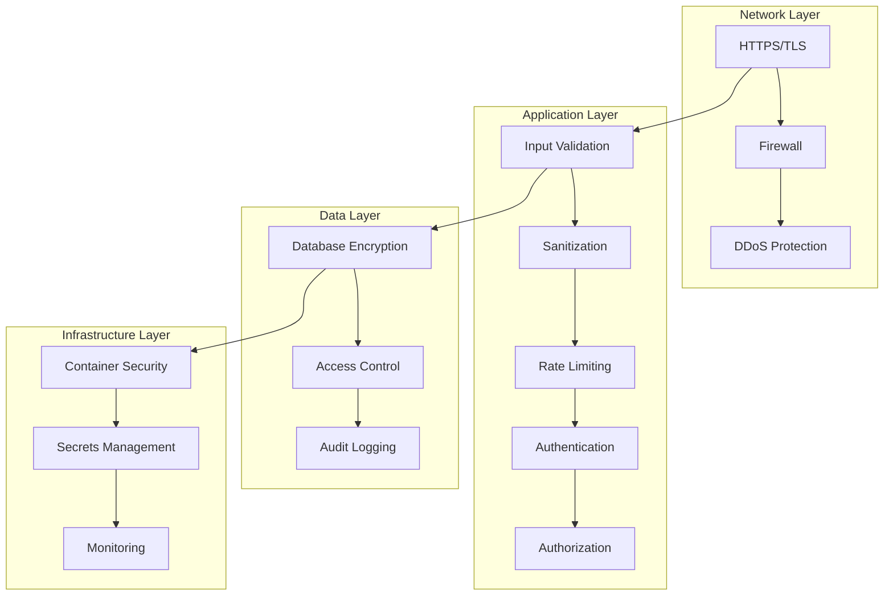
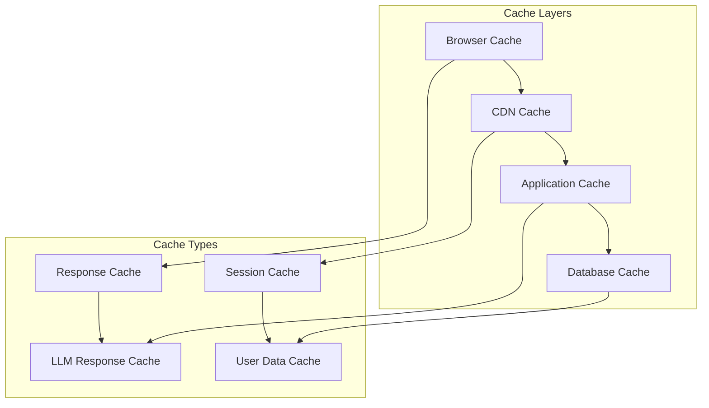
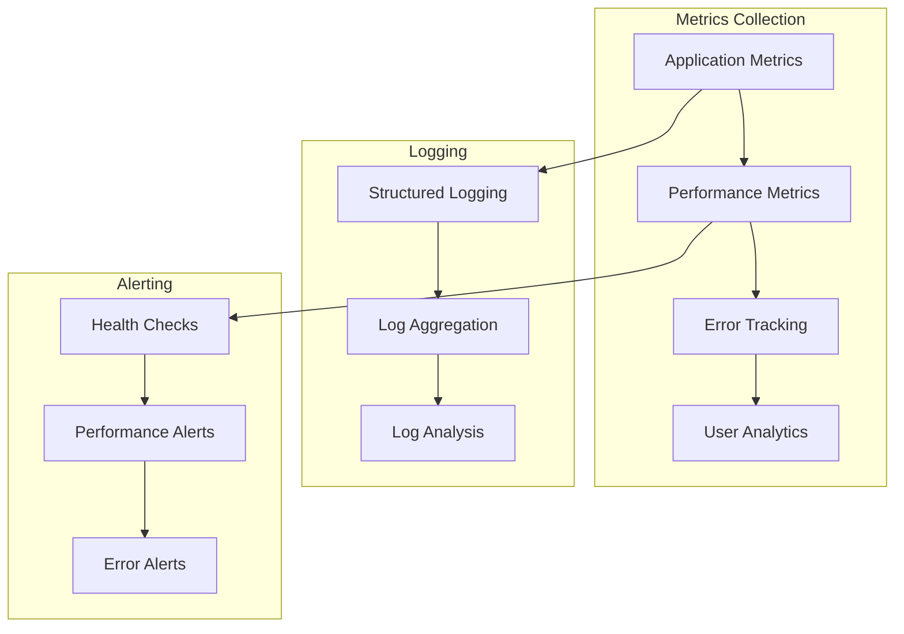
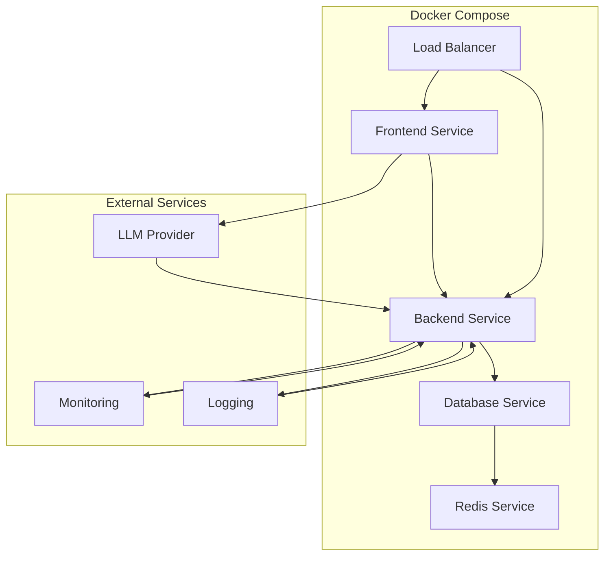

# 🏗️ Orion AI Architecture Documentation

## System Architecture Overview

Orion AI follows a layered architecture pattern with clear separation of concerns between frontend, backend, data, and AI layers.

### High-Level Architecture Diagram



## Component Architecture

### Frontend Architecture

#### React Application Structure
```
frontend/
├── src/
│   ├── components/
│   │   ├── ChatInterface.tsx      # Main chat interface
│   │   ├── MessageList.tsx        # Message display component
│   │   ├── InputArea.tsx          # User input component
│   │   ├── TypingIndicator.tsx    # Typing animation
│   │   └── SettingsPanel.tsx      # Configuration panel
│   ├── pages/
│   │   ├── Dashboard.tsx          # Main application page
│   │   ├── LandingPage.tsx        # Landing page
│   │   ├── LoginPage.tsx          # Authentication page
│   │   └── RegisterPage.tsx       # Registration page
│   ├── services/
│   │   └── api.ts                 # API communication layer
│   ├── hooks/
│   │   └── useChat.ts             # Chat state management
│   └── context/
│       └── AuthContext.tsx        # Authentication context
```

#### Key Frontend Features
- **Real-time Streaming**: WebSocket-based communication for live responses
- **State Management**: Custom hooks for managing chat state and user sessions
- **Responsive Design**: Mobile-first approach with Tailwind CSS
- **Accessibility**: WCAG-compliant interface design

### Backend Architecture

#### FastAPI Application Structure
```
backend/
├── main.py                        # FastAPI application entry point
├── api/
│   └── schemas.py                 # Pydantic models and schemas
├── services/
│   ├── llm_service.py             # LLM provider integration
│   ├── config.py                  # Configuration management
│   ├── security.py                # Security utilities
│   ├── cache_service.py           # Caching layer
│   ├── smart_router.py            # Request routing logic
│   └── mock_agent.py              # Mock agent for testing
├── orchestration/
│   ├── workflow.py                # Agent workflow engine
│   └── features.py                # Feature management
├── agents/
│   ├── base_agent.py              # Base agent class
│   └── validation_agent.py        # Input validation agent
├── database/
│   ├── models.py                  # SQLAlchemy models
│   ├── db_manager.py              # Database operations
│   └── create_db.py               # Database initialization
├── utils/
│   └── logger.py                  # Logging configuration
└── tests/                         # Test suite
```

#### Key Backend Features
- **Async/await Pattern**: Full asynchronous architecture for performance
- **Dependency Injection**: Clean separation of concerns
- **Middleware Stack**: Security, logging, and rate limiting
- **Error Handling**: Comprehensive error management

## Data Flow Architecture

### Request Processing Flow



### Agent Communication Flow



## Database Architecture

### Entity Relationship Diagram



### Database Schema Details

#### Users Table
- **Purpose**: Store user authentication and profile information
- **Key Fields**: id, email, name, hashed_password, provider
- **Indexes**: Primary key on id, unique constraint on email

#### Chat Sessions Table
- **Purpose**: Manage conversation sessions
- **Key Fields**: id, user_id, title, created_at
- **Relationships**: One-to-many with Messages and Interactions

#### Messages Table
- **Purpose**: Store individual chat messages
- **Key Fields**: id, session_id, role, content, timestamp
- **Roles**: 'user' or 'assistant'

#### Interactions Table
- **Purpose**: Log complete user-agent interactions
- **Key Fields**: id, session_id, user_input, assistant_response, active_mode
- **Analytics**: Used for usage statistics and performance monitoring

## Security Architecture

### Security Layers



### Security Features

#### Input Validation
- **XSS Prevention**: HTML sanitization and escaping
- **SQL Injection**: Parameterized queries and ORM usage
- **Command Injection**: Input filtering and validation
- **Data Validation**: Schema validation using Pydantic

#### Authentication & Authorization
- **JWT Tokens**: Stateless authentication
- **Password Hashing**: bcrypt with salt
- **Session Management**: Secure session handling
- **Role-Based Access**: Permission-based access control

#### Data Protection
- **Encryption at Rest**: Database encryption
- **Encryption in Transit**: TLS/SSL for all communications
- **Secrets Management**: Environment variables and secure storage
- **Audit Trails**: Comprehensive logging of security events

## Performance Architecture

### Caching Strategy



### Performance Optimization

#### Frontend Optimizations
- **Code Splitting**: Lazy loading of components
- **Bundle Optimization**: Tree shaking and minification
- **Image Optimization**: WebP format and lazy loading
- **Caching Strategy**: Browser caching and service workers

#### Backend Optimizations
- **Connection Pooling**: Database connection reuse
- **Async Processing**: Non-blocking I/O operations
- **Caching Layer**: Redis for frequently accessed data
- **Load Balancing**: Horizontal scaling support

#### Database Optimizations
- **Indexing Strategy**: Optimized query performance
- **Query Optimization**: Efficient SQL queries
- **Connection Pooling**: Connection reuse and management
- **Data Partitioning**: Scalable data storage

## Monitoring & Observability

### Monitoring Stack



### Key Metrics

#### Application Metrics
- **Response Time**: API endpoint performance
- **Throughput**: Requests per second
- **Error Rate**: Failed request percentage
- **Memory Usage**: Application memory consumption

#### Business Metrics
- **User Engagement**: Active users and session duration
- **Feature Usage**: Popular features and functionality
- **Conversion Rates**: User onboarding and retention
- **Cost Metrics**: LLM API usage and costs

#### Infrastructure Metrics
- **CPU Usage**: Server resource utilization
- **Disk Usage**: Storage consumption and I/O
- **Network Traffic**: Bandwidth usage and latency
- **Container Health**: Docker container status

## Deployment Architecture

### Docker Architecture



### Deployment Strategy

#### Development Environment
- **Local Development**: Docker Compose for local setup
- **Hot Reloading**: Fast feedback during development
- **Debug Mode**: Enhanced debugging capabilities

#### Production Environment
- **Container Orchestration**: Docker Swarm or Kubernetes
- **Load Balancing**: High availability and scalability
- **Auto-scaling**: Dynamic resource allocation
- **Blue-Green Deployment**: Zero-downtime deployments

#### CI/CD Pipeline
- **Automated Testing**: Unit, integration, and load tests
- **Security Scanning**: Vulnerability assessment
- **Performance Testing**: Load and stress testing
- **Deployment Automation**: Automated deployment to staging and production

This architecture provides a solid foundation for a production-grade AI system that is scalable, secure, and maintainable.