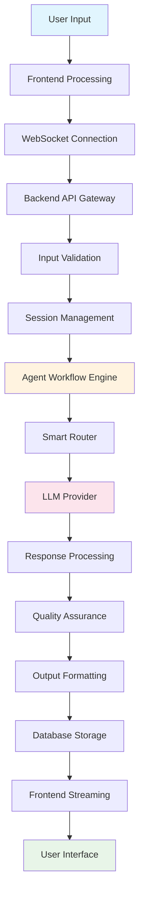
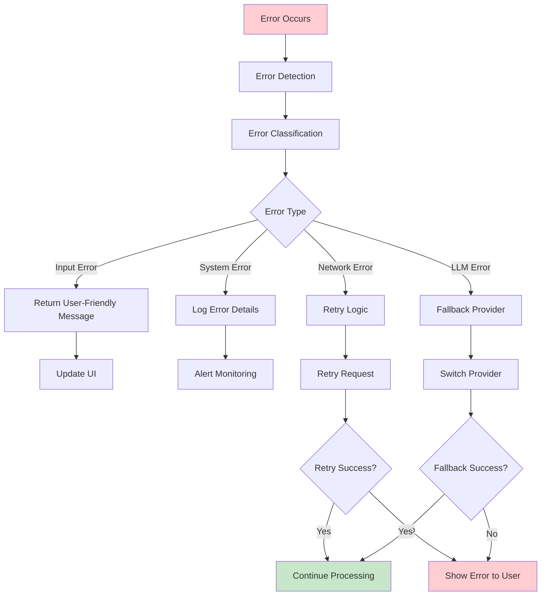
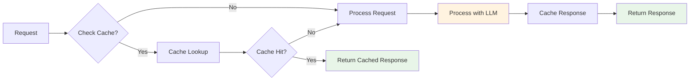

# 🔄 Orion AI Execution Flow Documentation

## Overview

This document provides a detailed breakdown of the execution flow within the Orion AI system, from user input to final response generation. Understanding this flow is crucial for development, debugging, and optimization.

## High-Level Execution Flow



## Detailed Execution Flow

### 1. Frontend Processing

#### User Input Capture
```typescript
// InputArea.tsx
const handleSubmit = async (message: string) => {
  // 1. Validate input
  if (!message.trim()) return;
  
  // 2. Add user message to local state
  addMessage({ role: 'user', content: message });
  
  // 3. Clear input field
  setInput('');
  
  // 4. Initiate streaming request
  const stream = await api.streamMessage({
    user_input: message,
    metadata: {
      session_id: currentSession?.id,
      active_mode: selectedMode
    }
  });
  
  // 5. Process streaming response
  processStreamResponse(stream);
};
```

#### WebSocket Connection Management
```typescript
// useChat.ts
const connectWebSocket = () => {
  const ws = new WebSocket(`${WS_URL}/ws`);
  
  ws.onopen = () => {
    console.log('WebSocket connected');
    setConnectionStatus('connected');
  };
  
  ws.onmessage = (event) => {
    const data = JSON.parse(event.data);
    handleStreamEvent(data);
  };
  
  ws.onclose = () => {
    setConnectionStatus('disconnected');
    // Implement reconnection logic
    setTimeout(connectWebSocket, 1000);
  };
  
  return ws;
};
```

### 2. Backend API Gateway

#### Request Processing Pipeline
```python
# main.py
@app.post("/api/stream")
@limiter.limit("20/minute")
async def stream_process(request: Request, validation_request: InputValidationRequest):
    """
    Main streaming endpoint with comprehensive request processing
    """
    # 1. Rate limiting check
    # 2. Input sanitization
    sanitized_input = SecurityService.sanitize_input(validation_request.user_input)
    
    # 3. Session validation
    session_id = validation_request.metadata.get("session_id")
    if session_id:
        session = db_manager.get_session(session_id)
        if not session:
            raise HTTPException(status_code=404, detail="Session not found")
    
    # 4. Mode validation
    active_mode = validation_request.metadata.get("active_mode", "Standard Operations")
    if active_mode not in ["Standard Operations", "Deep Research", "Coding Logic"]:
        raise HTTPException(status_code=400, detail="Invalid operational mode")
    
    # 5. Initiate streaming response
    return StreamingResponse(
        event_generator(sanitized_input, session_id, active_mode),
        media_type="application/x-ndjson"
    )
```

### 3. Input Validation & Security

#### Security Service Implementation
```python
# services/security.py
class SecurityService:
    @staticmethod
    def sanitize_input(user_input: str) -> str:
        """Sanitize user input to prevent XSS and injection attacks"""
        # Remove potentially dangerous characters
        dangerous_patterns = [
            r'<script.*?</script>',
            r'javascript:',
            r'data:',
            r'vbscript:',
            r'on\w+=".*?"'
        ]
        
        sanitized = user_input
        for pattern in dangerous_patterns:
            sanitized = re.sub(pattern, '', sanitized, flags=re.IGNORECASE)
        
        # Limit input length
        if len(sanitized) > 10000:
            sanitized = sanitized[:10000]
        
        return sanitized.strip()
    
    @staticmethod
    def validate_session(session_id: str) -> bool:
        """Validate session exists and is active"""
        session = db_manager.get_session(session_id)
        return session is not None and session.is_active
```

### 4. Agent Workflow Engine

#### Workflow Execution
```python
# orchestration/workflow.py
class AgentWorkflow:
    def __init__(self):
        self.agents = {
            'validation': ValidationAgent(),
            'analysis': AnalysisAgent(),
            'processing': ProcessingAgent(),
            'qa': QualityAssuranceAgent(),
            'formatting': FormattingAgent()
        }
        self.llm_service = LLMService()
    
    async def execute_workflow_stream(self, user_input: str, session_id: str, active_mode: str):
        """Execute the complete agent workflow with streaming"""
        
        # 1. Input Validation
        validation_result = await self.agents['validation'].validate(user_input)
        if not validation_result.is_valid:
            yield {"type": "error", "content": validation_result.error_message}
            return
        
        # 2. Task Analysis
        task_plan = await self.agents['analysis'].analyze_task(user_input, active_mode)
        yield {"type": "thought", "content": f"Task analysis complete: {task_plan.description}"}
        
        # 3. Content Processing (Main LLM Interaction)
        async for event in self._process_content_stream(user_input, task_plan, session_id):
            yield event
        
        # 4. Quality Assurance
        qa_result = await self.agents['qa'].validate_output(final_response)
        if not qa_result.is_valid:
            yield {"type": "error", "content": "Quality check failed"}
            return
        
        # 5. Output Formatting
        formatted_output = await self.agents['formatting'].format_response(qa_result.content)
        yield {"type": "completion", "content": formatted_output}
    
    async def _process_content_stream(self, user_input: str, task_plan: TaskPlan, session_id: str):
        """Process content with real-time streaming"""
        
        # Check smart router for cached responses
        cached_response = smart_router.check_cache(user_input, task_plan.mode)
        if cached_response:
            yield {"type": "tool_output", "content": "Retrieved from cache"}
            for chunk in self._chunk_response(cached_response):
                yield {"type": "token", "content": chunk}
            return
        
        # Process with LLM
        async for event in self.llm_service.stream_response(user_input, task_plan):
            yield event
            
            # Save intermediate results for long responses
            if event["type"] == "token":
                self._save_intermediate_result(session_id, event["content"])
```

### 5. Smart Router System

#### Intelligent Request Routing
```python
# services/smart_router.py
class SmartRouter:
    def __init__(self):
        self.local_cache = {}
        self.knowledge_base = KnowledgeBase()
    
    def route_request(self, user_input: str, mode: str) -> Optional[Dict]:
        """Route request to optimal source"""
        
        # 1. Check local cache
        cached = self._check_cache(user_input, mode)
        if cached:
            return {"source": "cache", "content": cached}
        
        # 2. Check knowledge base
        kb_result = self.knowledge_base.query(user_input, mode)
        if kb_result and kb_result.confidence > 0.8:
            return {"source": "knowledge_base", "content": kb_result.content}
        
        # 3. Route to LLM provider
        return None  # Indicates need for LLM processing
    
    def _check_cache(self, user_input: str, mode: str) -> Optional[str]:
        """Check for cached responses"""
        cache_key = self._generate_cache_key(user_input, mode)
        if cache_key in self.local_cache:
            cached_item = self.local_cache[cache_key]
            if time.time() - cached_item['timestamp'] < CACHE_TTL:
                return cached_item['content']
        return None
    
    def update_cache(self, user_input: str, mode: str, response: str):
        """Update cache with new response"""
        cache_key = self._generate_cache_key(user_input, mode)
        self.local_cache[cache_key] = {
            'content': response,
            'timestamp': time.time(),
            'access_count': 0
        }
```

### 6. LLM Service Integration

#### Multi-Provider Support
```python
# services/llm_service.py
class LLMService:
    def __init__(self):
        self.providers = {
            'gemini': GeminiProvider(),
            'openai': OpenAIProvider(),
            'anthropic': AnthropicProvider()
        }
        self.current_provider = settings.llm_provider
    
    async def stream_response(self, user_input: str, task_plan: TaskPlan):
        """Stream response from configured LLM provider"""
        
        provider = self.providers[self.current_provider]
        
        # Prepare request
        request_data = {
            'prompt': user_input,
            'model': task_plan.model,
            'temperature': task_plan.temperature,
            'max_tokens': task_plan.max_tokens
        }
        
        # Stream response
        async for chunk in provider.stream_completion(request_data):
            yield {
                "type": "token",
                "content": chunk,
                "provider": self.current_provider
            }
    
    async def get_completion(self, prompt: str, model: str = None) -> str:
        """Get complete response (non-streaming)"""
        provider = self.providers[self.current_provider]
        return await provider.get_completion(prompt, model)
```

### 7. Response Processing Pipeline

#### Quality Assurance
```python
# agents/quality_assurance_agent.py
class QualityAssuranceAgent:
    async def validate_output(self, response: str) -> ValidationResult:
        """Validate response quality and safety"""
        
        # 1. Content Safety Check
        safety_score = self._check_content_safety(response)
        if safety_score < 0.8:
            return ValidationResult(
                is_valid=False,
                error_message="Content safety check failed"
            )
        
        # 2. Response Completeness
        completeness_score = self._check_completeness(response)
        if completeness_score < 0.7:
            return ValidationResult(
                is_valid=False,
                error_message="Response appears incomplete"
            )
        
        # 3. Factual Accuracy (basic check)
        accuracy_score = self._check_factual_accuracy(response)
        
        # 4. Format Validation
        format_valid = self._validate_format(response)
        
        overall_score = (safety_score + completeness_score + accuracy_score) / 3
        
        return ValidationResult(
            is_valid=overall_score > 0.75 and format_valid,
            content=response,
            confidence=overall_score
        )
```

#### Output Formatting
```python
# agents/formatting_agent.py
class FormattingAgent:
    async def format_response(self, content: str) -> str:
        """Format response for optimal user experience"""
        
        # 1. Markdown Processing
        formatted = self._process_markdown(content)
        
        # 2. Code Block Highlighting
        formatted = self._highlight_code_blocks(formatted)
        
        # 3. Link Processing
        formatted = self._process_links(formatted)
        
        # 4. Typography Improvements
        formatted = self._improve_typography(formatted)
        
        return formatted
    
    def _process_markdown(self, content: str) -> str:
        """Process markdown formatting"""
        # Convert headers, lists, emphasis, etc.
        # Ensure proper spacing and formatting
        return processed_content
```

### 8. Database Operations

#### Session and Interaction Management
```python
# database/db_manager.py
class DatabaseManager:
    def __init__(self):
        self.engine = create_engine(settings.database_url)
        SessionLocal = sessionmaker(autocommit=False, autoflush=False, bind=self.engine)
        self.SessionLocal = SessionLocal
    
    def add_message(self, session_id: str, role: str, content: str):
        """Add message to conversation history"""
        db = self.SessionLocal()
        try:
            message = Message(
                session_id=session_id,
                role=role,
                content=content,
                timestamp=datetime.utcnow()
            )
            db.add(message)
            db.commit()
        finally:
            db.close()
    
    def add_interaction(self, session_id: str, user_input: str, assistant_response: str):
        """Log complete user-agent interaction"""
        db = self.SessionLocal()
        try:
            interaction = Interaction(
                session_id=session_id,
                user_input=user_input,
                assistant_response=assistant_response,
                timestamp=datetime.utcnow()
            )
            db.add(interaction)
            db.commit()
        finally:
            db.close()
    
    def get_session_history(self, session_id: str) -> List[Message]:
        """Retrieve conversation history for a session"""
        db = self.SessionLocal()
        try:
            messages = db.query(Message).filter(
                Message.session_id == session_id
            ).order_by(Message.timestamp).all()
            return messages
        finally:
            db.close()
```

### 9. Frontend Response Handling

#### Stream Event Processing
```typescript
// useChat.ts
const processStreamResponse = async (stream: AsyncIterable<any>) => {
  let fullResponse = '';
  
  for await (const event of stream) {
    switch (event.type) {
      case 'thought':
        addThought(event.content);
        break;
        
      case 'action':
        addAction(event.content);
        break;
        
      case 'token':
        fullResponse += event.content;
        updateCurrentMessage(fullResponse);
        break;
        
      case 'tool_output':
        addToolOutput(event.content);
        break;
        
      case 'completion':
        finalizeMessage(fullResponse, event.content);
        break;
        
      case 'error':
        handleStreamError(event.content);
        break;
    }
  }
};

const finalizeMessage = (content: string, metadata: any) => {
  addMessage({
    role: 'assistant',
    content: content,
    metadata: metadata
  });
  
  // Update session with final response
  if (currentSession) {
    updateSession(currentSession.id, {
      last_activity: new Date().toISOString(),
      response_count: (currentSession.response_count || 0) + 1
    });
  }
};
```

## Error Handling Flow

### Error Propagation


### Error Recovery Strategies
```python
# Error handling in workflow
async def execute_with_retry(self, operation, max_retries=3):
    """Execute operation with retry logic"""
    for attempt in range(max_retries):
        try:
            return await operation()
        except NetworkError as e:
            if attempt == max_retries - 1:
                raise
            await asyncio.sleep(2 ** attempt)  # Exponential backoff
        except LLMProviderError as e:
            # Try fallback provider
            self.switch_provider()
            if attempt == max_retries - 1:
                raise
```

## Performance Optimization Flow

### Caching Strategy


### Load Balancing
```python
# Load balancing across providers
class LoadBalancer:
    def __init__(self, providers):
        self.providers = providers
        self.weights = {provider: 1.0 for provider in providers}
    
    def select_provider(self) -> str:
        """Select provider based on load and performance"""
        # Weighted random selection
        total_weight = sum(self.weights.values())
        random_value = random.uniform(0, total_weight)
        
        current_weight = 0
        for provider, weight in self.weights.items():
            current_weight += weight
            if random_value <= current_weight:
                return provider
```

## Monitoring and Analytics Flow

### Metrics Collection
```python
# Metrics collection throughout the flow
class MetricsCollector:
    def __init__(self):
        self.metrics = {
            'request_count': 0,
            'response_time': [],
            'error_rate': 0,
            'provider_usage': defaultdict(int)
        }
    
    def record_request(self, request_id: str, timestamp: float):
        """Record request start"""
        self.metrics['request_count'] += 1
        self.active_requests[request_id] = timestamp
    
    def record_completion(self, request_id: str, response_time: float, provider: str):
        """Record request completion"""
        if request_id in self.active_requests:
            self.metrics['response_time'].append(response_time)
            self.metrics['provider_usage'][provider] += 1
            del self.active_requests[request_id]
```

This comprehensive execution flow documentation provides insight into how Orion AI processes requests from start to finish, ensuring reliability, performance, and user satisfaction.