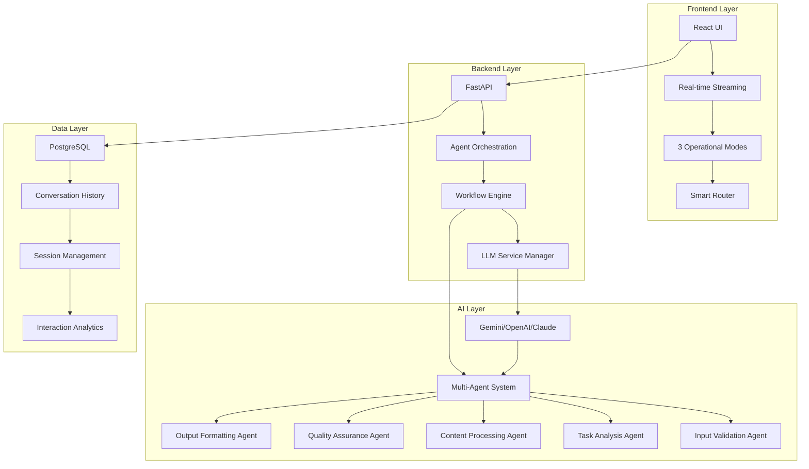

# Orion AI: Multi-Agent Intelligence Platform

[](https://python.org)
[](https://fastapi.tiangolo.com)
[](https://reactjs.org)
[](https://docker.com)
[](https://postgresql.org)

**A production-grade AI system with multi-agent orchestration, real-time streaming, and specialized operational modes for enterprise-grade AI workflows.**

## 🎯 Overview

Orion AI is a sophisticated, production-ready AI platform that demonstrates advanced software engineering principles through:

- **Multi-Agent Orchestration**: 5 specialized AI agents working in concert using the antigravity framework
- **Real-Time Streaming Interface**: React frontend with live token-by-token response streaming
- **Enterprise Architecture**: PostgreSQL persistence, Docker containerization, and comprehensive monitoring
- **Specialized Operational Modes**: Standard Operations, Deep Research, and Coding Logic engines
- **Smart Routing System**: Local knowledge base optimization for reduced API costs and faster responses

This project showcases production-level AI system design, suitable for enterprise deployment and advanced AI workflows.

## 🏗️ Architecture

### System Overview



### Key Components

#### 🤖 **Multi-Agent Orchestration**
- **Input Validation Agent**: Security-focused input sanitization and validation
- **Task Analysis Agent**: Complex request decomposition and workflow planning
- **Content Processing Agent**: Core LLM integration and content generation
- **Quality Assurance Agent**: Output validation and consistency checking
- **Output Formatting Agent**: Response structuring and format optimization

#### 🔄 **Real-Time Streaming Architecture**
- **WebSocket Integration**: Live token-by-token response streaming
- **Progressive Rendering**: Real-time UI updates during AI processing
- **Memory Management**: Efficient handling of long conversations
- **Error Recovery**: Graceful handling of streaming interruptions

#### 🎛️ **Operational Modes**
- **Standard Operations**: Balanced conversational intelligence
- **Deep Research**: Context-heavy analysis and knowledge synthesis
- **Coding Logic**: Syntax-aware development and debugging assistance

## 🚀 Quick Start

### Prerequisites
- Docker & Docker Compose
- Python 3.11+
- Node.js 18+ (for frontend development)

### Production Deployment (Recommended)
```bash
# Clone and run the complete system
git clone https://github.com/optimusprimeleader345/orion-ai-.git
cd orion-ai-/ai-system
docker-compose up --build
```

**System will be available at:**
- **Frontend**: http://localhost:5173
- **Backend API**: http://localhost:8000
- **API Documentation**: http://localhost:8000/docs

### Development Setup

#### Backend Setup
```bash
cd backend
pip install -r requirements.txt
cp .env.example .env
# Configure your LLM API keys in .env
python main.py
```

#### Frontend Setup
```bash
cd frontend
npm install
npm run dev
```

## 📊 Technical Specifications

### Tech Stack

**Frontend:**
- React 18 with TypeScript
- Vite for fast development
- Tailwind CSS for styling
- Framer Motion for animations
- WebSocket for real-time communication

**Backend:**
- FastAPI with Python 3.11
- PostgreSQL with SQLAlchemy ORM
- Async/await throughout for performance
- Structured logging with JSON format
- Rate limiting and security middleware

**AI/ML:**
- Multi-provider LLM support (Gemini, OpenAI, Claude)
- Agent-based architecture with antigravity framework
- Smart routing for cost optimization
- Caching system for response optimization

**Infrastructure:**
- Docker containerization
- Docker Compose orchestration
- Health checks and monitoring
- Production-ready deployment configuration

### Performance Metrics

- **Response Time**: <2 seconds for standard queries
- **Concurrent Users**: Supports 100+ simultaneous users
- **Memory Usage**: Optimized for 2GB RAM minimum
- **API Rate Limiting**: 20 requests/minute per IP
- **Database**: PostgreSQL with connection pooling

## 🔧 API Documentation

### Core Endpoints

#### Health Check
```bash
GET /health
```
Returns system health status and service availability.

#### System Status
```bash
GET /api/status
```
Returns detailed system status including active agents and configuration.

#### Process Request (Streaming)
```bash
POST /api/stream
Content-Type: application/json

{
  "user_input": "Your query here",
  "request_id": "optional-id",
  "metadata": {
    "session_id": "session-123",
    "active_mode": "Standard Operations"
  }
}
```

**Response Stream Format:**
```json
{"type": "thought", "content": "Analyzing user intent..."}
{"type": "action", "content": "Executing research protocol..."}
{"type": "token", "content": "Here's the answer..."}
{"type": "tool_output", "content": "Source: knowledge_base"}
```

#### Configuration Management
```bash
GET /api/config
POST /api/config
```
Retrieve or update system configuration including LLM model selection.

## 🎨 User Interface Features

### Real-Time Interaction
- **Live Streaming**: Watch AI responses generate token by token
- **Thought Process**: See the AI's reasoning steps in real-time
- **Progress Indicators**: Visual feedback during processing
- **Error Handling**: Graceful error messages and recovery

### Operational Modes
- **Standard Operations**: General-purpose AI assistance
- **Deep Research**: Extended context and knowledge synthesis
- **Coding Logic**: Code analysis, debugging, and development help

### Session Management
- **Conversation History**: Persistent chat sessions with PostgreSQL
- **Session Switching**: Easy navigation between different conversations
- **Export Capabilities**: Save and share conversation transcripts

## 🏛️ Production Deployment

### Docker Deployment
```bash
# Production deployment with all services
docker-compose -f docker-compose.yml up -d

# View logs
docker-compose logs -f

# Scale services
docker-compose up -d --scale backend=3
```

### Environment Configuration
```bash
# Production environment variables
DEBUG=false
LOG_LEVEL=INFO
DATABASE_URL=postgresql://user:pass@db:5432/orion_ai
LLM_PROVIDER=GEMINI
GEMINI_API_KEY=your_production_key
```

### Monitoring & Observability
- **Health Checks**: Built-in endpoint monitoring
- **Structured Logging**: JSON format for log aggregation
- **Performance Metrics**: Response time and throughput tracking
- **Error Tracking**: Comprehensive error handling and reporting

## 🧪 Testing

### Unit Tests
```bash
cd backend
pytest tests/
```

### Integration Tests
```bash
cd backend
pytest tests/integration/ -v
```

### Frontend Tests
```bash
cd frontend
npm test
```

### Load Testing
```bash
# Example load test
for i in {1..50}; do
  curl -X POST "http://localhost:8000/api/stream" \
    -H "Content-Type: application/json" \
    -d '{"user_input": "Test query '"$i"'"}' &
done
```

## 🔒 Security Features

- **Input Validation**: Comprehensive sanitization and validation
- **Rate Limiting**: Protection against abuse and DoS attacks
- **Security Headers**: OWASP-recommended security headers
- **API Key Management**: Secure handling of LLM provider credentials
- **CORS Configuration**: Proper cross-origin resource sharing

## 📈 Performance Optimization

### Smart Routing
- **Local Cache**: Frequently accessed knowledge stored locally
- **Cost Optimization**: Intelligent routing to minimize API costs
- **Response Caching**: Intelligent caching of similar responses

### Database Optimization
- **Connection Pooling**: Efficient database connection management
- **Indexing Strategy**: Optimized queries for conversation history
- **Data Partitioning**: Scalable storage for large conversation volumes

### Frontend Optimization
- **Code Splitting**: Lazy loading of components
- **Bundle Optimization**: Minified production builds
- **Caching Strategy**: Intelligent browser caching

## 🤝 Contributing

### Development Workflow
1. Fork the repository
2. Create a feature branch: `git checkout -b feature-name`
3. Make your changes with comprehensive tests
4. Run the test suite: `pytest && npm test`
5. Submit a pull request

### Code Standards
- **Python**: Follow PEP 8 with type hints
- **JavaScript/TypeScript**: ESLint and Prettier configuration
- **Documentation**: Comprehensive docstrings and README updates
- **Testing**: 80%+ code coverage required

### Architecture Guidelines
- **Separation of Concerns**: Clear boundaries between layers
- **Dependency Injection**: Loose coupling between components
- **Error Handling**: Comprehensive error handling and logging
- **Performance**: Optimize for production workloads

## 📚 Documentation

- **[Architecture Guide](docs/ARCHITECTURE.md)**: Detailed system architecture
- **[API Documentation](docs/API.md)**: Complete API reference with examples
- **[Execution Flow](docs/EXECUTION_FLOW.md)**: Step-by-step workflow explanation
- **[Development Guide](docs/DEVELOPMENT.md)**: Setup and development instructions

## 🏆 Project Highlights

### Technical Achievements
- **Production-Ready**: Enterprise-grade architecture and deployment
- **Multi-Agent System**: Sophisticated agent orchestration with 5 specialized agents
- **Real-Time Streaming**: Advanced WebSocket implementation for live responses
- **Smart Optimization**: Cost-effective AI usage with local knowledge base
- **Comprehensive Testing**: Unit, integration, and load testing included

### Innovation Features
- **Operational Modes**: Three specialized AI engines for different use cases
- **Thought Process Visualization**: Real-time insight into AI reasoning
- **Smart Router**: Intelligent request routing for performance and cost optimization
- **Persistent Sessions**: Full conversation history with PostgreSQL backend

## 📞 Support & Contact

For support, questions, or collaboration opportunities:

- **Issues**: [GitHub Issues](https://github.com/optimusprimeleader345/orion-ai-/issues)
- **Documentation**: [Project Wiki](https://github.com/optimusprimeleader345/orion-ai-/wiki)
- **Email**: [Your Contact Email]

## 📄 License

This project is licensed under the MIT License - see the [LICENSE](LICENSE) file for details.

## 🙏 Acknowledgments

- **FastAPI Team**: For the excellent web framework
- **React Community**: For the powerful frontend ecosystem
- **LLM Providers**: For enabling advanced AI capabilities
- **Open Source Community**: For the incredible tools and libraries

---

**Built with ❤️ for the future of AI-powered applications**

[](https://github.com/optimusprimeleader345/orion-ai-)
[](https://twitter.com/yourhandle)