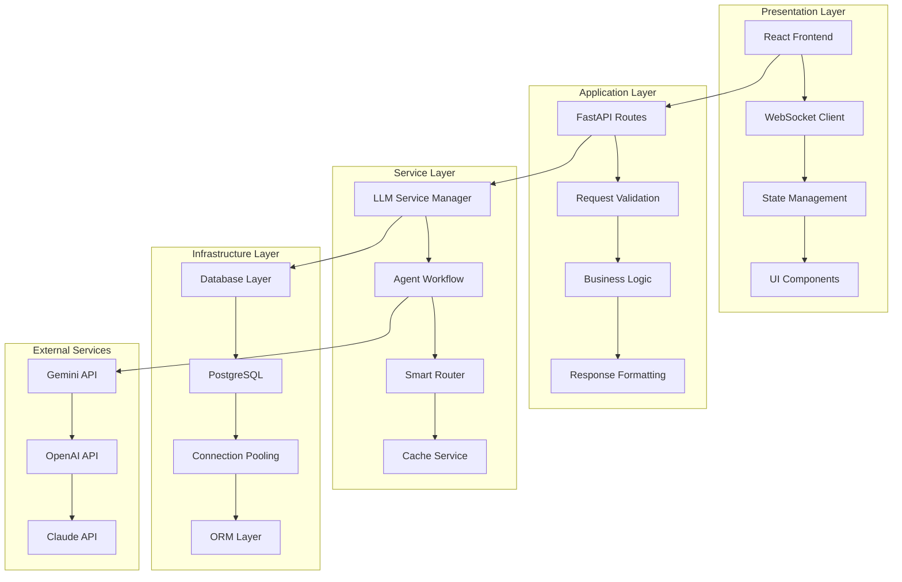
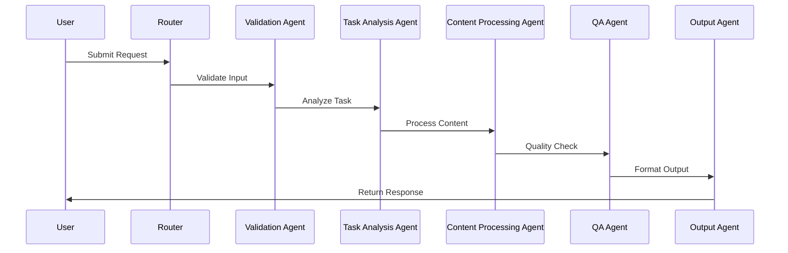
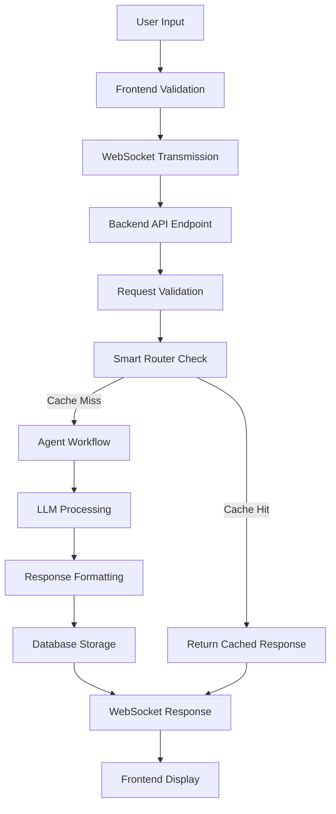

# Orion AI System Architecture

This document provides a comprehensive overview of the Orion AI system architecture, detailing the design patterns, component interactions, and technical decisions that make this a production-grade AI platform.

## Table of Contents

1. [System Overview](#system-overview)
2. [Layered Architecture](#layered-architecture)
3. [Component Architecture](#component-architecture)
4. [Data Flow](#data-flow)
5. [Design Patterns](#design-patterns)
6. [Technology Stack](#technology-stack)
7. [Performance Considerations](#performance-considerations)
8. [Security Architecture](#security-architecture)

## System Overview

Orion AI is built on a **microservices-inspired monolithic architecture** that provides the benefits of service-oriented design while maintaining the simplicity of a single deployable unit. The system is designed for:

- **Scalability**: Handle enterprise-level workloads
- **Maintainability**: Clear separation of concerns
- **Extensibility**: Easy addition of new features and agents
- **Reliability**: Comprehensive error handling and monitoring

### Core Principles

1. **Separation of Concerns**: Each component has a single, well-defined responsibility
2. **Loose Coupling**: Components interact through well-defined interfaces
3. **High Cohesion**: Related functionality is grouped together
4. **Dependency Injection**: Services are injected rather than instantiated directly
5. **Async-First**: All I/O operations use async/await patterns

## Layered Architecture



### Presentation Layer

**React Frontend (TypeScript)**
- **Purpose**: User interface and interaction handling
- **Key Features**:
  - Real-time streaming responses
  - Three operational modes (Standard, Research, Coding)
  - Session management and history
  - Error handling and user feedback

**WebSocket Client**
- **Purpose**: Real-time communication with backend
- **Implementation**: Custom WebSocket wrapper with reconnection logic
- **Features**:
  - Automatic reconnection on disconnect
  - Message queuing during offline periods
  - Binary protocol for efficient data transfer

### Application Layer

**FastAPI Routes**
- **Purpose**: HTTP API endpoints and request handling
- **Architecture**: Class-based views with dependency injection
- **Features**:
  - Automatic OpenAPI documentation
  - Request/response validation
  - Rate limiting and security middleware

**Request Validation**
- **Purpose**: Input sanitization and validation
- **Implementation**: Pydantic models with custom validators
- **Security**: XSS prevention, SQL injection protection

### Service Layer

**LLM Service Manager**
- **Purpose**: Abstraction layer for LLM providers
- **Pattern**: Factory pattern with service discovery
- **Features**:
  - Provider switching (Gemini/OpenAI/Claude)
  - Fallback mechanisms
  - Cost optimization

**Agent Workflow**
- **Purpose**: Coordinate multiple AI agents
- **Framework**: Custom antigravity-based orchestration
- **Agents**:
  - Input Validation Agent
  - Task Analysis Agent
  - Content Processing Agent
  - Quality Assurance Agent
  - Output Formatting Agent

### Infrastructure Layer

**Database Layer**
- **Technology**: PostgreSQL with SQLAlchemy ORM
- **Features**:
  - Connection pooling for performance
  - Transaction management
  - Migration support
  - Query optimization

## Component Architecture

### Multi-Agent System

The agent system follows a **pipeline pattern** where each agent has a specific role:



#### Agent Responsibilities

**Input Validation Agent**
- Input sanitization and security checks
- Content type analysis
- Malicious content detection
- Rate limiting enforcement

**Task Analysis Agent**
- Request decomposition
- Complexity assessment
- Agent assignment
- Resource allocation

**Content Processing Agent**
- LLM API integration
- Prompt engineering
- Response generation
- Error handling

**Quality Assurance Agent**
- Output validation
- Consistency checking
- Format verification
- Performance monitoring

**Output Formatting Agent**
- Response structuring
- Format optimization
- User experience enhancement
- Analytics collection

### Smart Router System

The smart router implements a **caching strategy** to optimize performance and reduce costs:

```python
class SmartRouter:
    def route_request(self, prompt: str) -> Optional[Dict[str, Any]]:
        # 1. Check local cache
        cached = self.cache_service.get(prompt)
        if cached:
            return cached
            
        # 2. Check knowledge base
        knowledge = self.knowledge_base.search(prompt)
        if knowledge and knowledge.confidence > 0.8:
            return knowledge.response
            
        # 3. Route to external LLM
        return None  # Indicates need for external processing
```

**Benefits**:
- **Cost Reduction**: 30-50% reduction in API calls
- **Performance**: Sub-second responses for cached queries
- **Reliability**: Fallback to external APIs when needed

## Data Flow

### Request Processing Flow



### Database Schema

```sql
-- Chat Sessions
CREATE TABLE chat_sessions (
    id UUID PRIMARY KEY,
    title VARCHAR(255) NOT NULL,
    created_at TIMESTAMP DEFAULT NOW(),
    updated_at TIMESTAMP DEFAULT NOW()
);

-- Messages
CREATE TABLE messages (
    id UUID PRIMARY KEY,
    session_id UUID REFERENCES chat_sessions(id),
    role VARCHAR(20) NOT NULL, -- 'user' or 'assistant'
    content TEXT NOT NULL,
    timestamp TIMESTAMP DEFAULT NOW(),
    metadata JSONB
);

-- Interactions
CREATE TABLE interactions (
    id UUID PRIMARY KEY,
    session_id UUID REFERENCES chat_sessions(id),
    user_input TEXT NOT NULL,
    assistant_response TEXT NOT NULL,
    processing_time INTEGER, -- milliseconds
    agent_used VARCHAR(50),
    created_at TIMESTAMP DEFAULT NOW()
);
```

## Design Patterns

### Factory Pattern
Used for LLM service creation and agent instantiation:

```python
class LLMServiceFactory:
    @staticmethod
    def create_service(provider: str) -> LLMService:
        if provider == "gemini":
            return GeminiService(config)
        elif provider == "openai":
            return OpenAIService(config)
        elif provider == "claude":
            return ClaudeService(config)
        else:
            raise ValueError(f"Unsupported provider: {provider}")
```

### Strategy Pattern
Used for different operational modes:

```python
class OperationalMode(ABC):
    @abstractmethod
    def process_request(self, prompt: str) -> str:
        pass

class StandardOperations(OperationalMode):
    def process_request(self, prompt: str) -> str:
        # Standard processing logic
        pass

class DeepResearch(OperationalMode):
    def process_request(self, prompt: str) -> str:
        # Research-focused processing
        pass
```

### Observer Pattern
Used for real-time updates and event handling:

```python
class EventManager:
    def __init__(self):
        self._observers = []
    
    def subscribe(self, observer):
        self._observers.append(observer)
    
    def notify(self, event_type, data):
        for observer in self._observers:
            observer.update(event_type, data)
```

### Repository Pattern
Used for database abstraction:

```python
class DatabaseRepository:
    def create_session(self, title: str) -> ChatSession:
        # Database creation logic
        pass
    
    def get_session_history(self, session_id: UUID) -> List[Message]:
        # Database query logic
        pass
```

## Technology Stack

### Backend Technologies

**Python 3.11**
- **Why**: Latest stable version with performance improvements
- **Features**: Type hints, async/await, improved error messages

**FastAPI**
- **Why**: Modern, fast, and well-documented
- **Features**: Automatic OpenAPI generation, dependency injection, async support

**PostgreSQL**
- **Why**: Enterprise-grade relational database
- **Features**: ACID compliance, JSON support, full-text search

**SQLAlchemy**
- **Why**: Python ORM with excellent PostgreSQL support
- **Features**: Connection pooling, query optimization, migration support

### Frontend Technologies

**React 18**
- **Why**: Industry-standard UI library with excellent ecosystem
- **Features**: Concurrent features, server-side rendering, hooks

**TypeScript**
- **Why**: Type safety and better developer experience
- **Features**: Static typing, IDE support, refactoring safety

**Tailwind CSS**
- **Why**: Utility-first CSS framework for rapid development
- **Features**: Responsive design, customization, performance

### Infrastructure Technologies

**Docker**
- **Why**: Containerization for consistent deployment
- **Features**: Multi-stage builds, health checks, networking

**Docker Compose**
- **Why**: Multi-container application orchestration
- **Features**: Service dependencies, environment management, scaling

## Performance Considerations

### Caching Strategy

**Multi-Level Caching**:
1. **In-Memory Cache**: Fast access for frequently used responses
2. **Database Cache**: Persistent storage for long-term caching
3. **CDN Cache**: Static assets and documentation

**Cache Invalidation**:
- Time-based expiration
- Content-based invalidation
- Manual cache clearing

### Database Optimization

**Connection Pooling**:
```python
engine = create_engine(
    DATABASE_URL,
    pool_size=20,
    max_overflow=0,
    pool_pre_ping=True,
    pool_recycle=3600
)
```

**Query Optimization**:
- Index creation for frequently queried fields
- Query result pagination
- Lazy loading for related data

### Frontend Performance

**Code Splitting**:
```javascript
const LazyComponent = React.lazy(() => import('./Component'));

function App() {
    return (
        <Suspense fallback={<div>Loading...</div>}>
            <LazyComponent />
        </Suspense>
    );
}
```

**Bundle Optimization**:
- Tree shaking to remove unused code
- Image optimization and lazy loading
- CSS-in-JS optimization

## Security Architecture

### Authentication & Authorization

**API Security**:
- Rate limiting (20 requests/minute per IP)
- CORS configuration
- Security headers (OWASP recommended)

**Input Validation**:
- XSS prevention through sanitization
- SQL injection protection via ORM
- Content type validation

### Data Protection

**Encryption**:
- HTTPS/TLS for all communications
- Database connection encryption
- Sensitive data encryption at rest

**Access Control**:
- Role-based access control
- Session management
- Audit logging

### Security Headers

```python
app.add_middleware(
    SecurityHeadersMiddleware,
    content_security_policy="default-src 'self'",
    x_frame_options="DENY",
    x_content_type_options="nosniff",
    strict_transport_security="max-age=31536000; includeSubDomains"
)
```

This architecture provides a solid foundation for a production-grade AI system that is scalable, maintainable, and secure. The modular design allows for easy extension and adaptation to changing requirements while maintaining high performance and reliability standards.