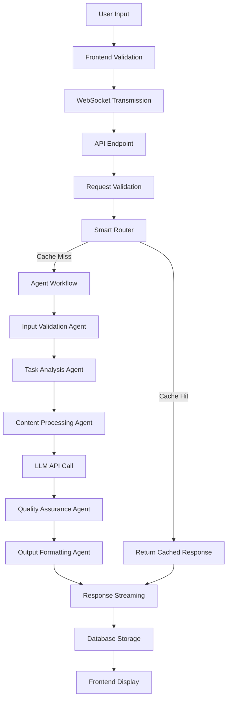

# Orion AI Execution Flow

This document provides a detailed explanation of the execution flow within the Orion AI system, from user input to final response generation. Understanding this flow is crucial for developers working on the system and for troubleshooting performance issues.

## Table of Contents

1. [Overview](#overview)
2. [Frontend Flow](#frontend-flow)
3. [Backend Processing Flow](#backend-processing-flow)
4. [Agent Workflow](#agent-workflow)
5. [Database Operations](#database-operations)
6. [Error Handling Flow](#error-handling-flow)
7. [Performance Optimization](#performance-optimization)
8. [Debugging and Monitoring](#debugging-and-monitoring)

## Overview

The Orion AI system follows a sophisticated execution flow designed for high performance, reliability, and user experience. The flow can be broken down into several key stages:

1. **User Input Processing** - Frontend validation and transmission
2. **Request Routing** - Backend API endpoint handling
3. **Smart Routing** - Local cache and knowledge base checks
4. **Agent Orchestration** - Multi-agent workflow execution
5. **LLM Processing** - External AI model integration
6. **Response Generation** - Output formatting and streaming
7. **Data Persistence** - Database storage and session management



## Frontend Flow

### 1. User Input Capture

**Component**: `InputArea.tsx`

```typescript
// Input validation and sanitization
const handleSendMessage = (message: string) => {
  // 1. Basic validation
  if (!message.trim()) return;
  
  // 2. Length validation
  if (message.length > 10000) {
    setError('Message too long (max 10,000 characters)');
    return;
  }
  
  // 3. Send to backend
  sendMessage(message);
};
```

**Key Features**:
- Input sanitization to prevent XSS attacks
- Character limit enforcement (10,000 characters)
- Real-time validation feedback
- Auto-scrolling for long inputs

### 2. WebSocket Communication

**Component**: `useChat.ts`

```typescript
// WebSocket connection management
const sendMessage = async (message: string) => {
  // 1. Add user message to local state
  addMessage('user', message);
  
  // 2. Send to backend
  const payload = {
    user_input: message,
    metadata: {
      session_id: activeSessionId,
      active_mode: activeMode
    }
  };
  
  // 3. Handle streaming response
  const response = await apiService.streamProcess(payload);
  processStreamResponse(response);
};
```

**Streaming Response Processing**:

```typescript
const processStreamResponse = (response: ReadableStream) => {
  const reader = response.getReader();
  const decoder = new TextDecoder();
  let fullResponse = '';
  
  const processChunk = async () => {
    const { done, value } = await reader.read();
    if (done) return;
    
    const chunk = decoder.decode(value);
    const lines = chunk.split('\n');
    
    for (const line of lines) {
      if (line.trim()) {
        const event = JSON.parse(line);
        handleStreamEvent(event);
      }
    }
    
    await processChunk();
  };
  
  processChunk();
};
```

### 3. Real-time UI Updates

**Component**: `ChatInterface.tsx`

```typescript
const handleStreamEvent = (event: StreamEvent) => {
  switch (event.type) {
    case 'thought':
      // Update thinking indicator
      setThinking(true);
      addThought(event.content);
      break;
      
    case 'action':
      // Update action indicator
      addAction(event.content);
      break;
      
    case 'token':
      // Update response content
      updateResponse(event.content);
      setThinking(false);
      break;
      
    case 'error':
      // Handle error
      setError(event.content);
      setThinking(false);
      break;
  }
};
```

## Backend Processing Flow

### 1. API Endpoint Processing

**File**: `backend/main.py`

```python
@app.post("/api/stream")
@limiter.limit("20/minute")
async def stream_process(request: Request, validation_request: InputValidationRequest):
    """
    Main streaming endpoint that orchestrates the entire processing flow.
    """
    # 1. Input sanitization
    sanitized_input = SecurityService.sanitize_input(validation_request.user_input)
    session_id = validation_request.metadata.get("session_id")
    
    # 2. Save user message
    if session_id:
        db_manager.add_message(session_id, "user", sanitized_input)
    
    # 3. Stream processing
    async def event_generator():
        try:
            # 4. Smart router check
            cached_or_local = smart_router.route_request(sanitized_input)
            
            if cached_or_local:
                # Fast path: return cached response
                yield {"type": "thought", "content": "Retrieving from local knowledge base..."}
                content = cached_or_local["content"]
                
                # Stream content in chunks
                for i in range(0, len(content), 100):
                    chunk = content[i:i+100]
                    yield {"type": "token", "content": chunk}
                    await asyncio.sleep(0.01)
                
                yield {"type": "tool_output", "content": f"Source: {cached_or_local.get('source', 'local')}"}
                return
            
            # 5. Fallback to agent workflow
            active_mode = validation_request.metadata.get("active_mode", "Standard Operations")
            async for event in workflow.execute_workflow_stream(
                sanitized_input, 
                validation_request.request_id,
                active_mode=active_mode,
                session_id=session_id
            ):
                yield event
                
        except Exception as e:
            yield {"type": "error", "content": str(e)}
    
    return StreamingResponse(event_generator(), media_type="application/x-ndjson")
```

### 2. Request Validation

**File**: `backend/api/schemas.py`

```python
class InputValidationRequest(BaseModel):
    user_input: str = Field(..., min_length=1, max_length=10000)
    request_id: Optional[str] = None
    metadata: Dict[str, Any] = {}
    
    @validator('user_input')
    def validate_input(cls, v):
        # Remove potentially dangerous content
        if any(pattern in v.lower() for pattern in ['<script>', 'javascript:', 'data:']):
            raise ValueError('Input contains potentially dangerous content')
        return v.strip()
```

## Agent Workflow

### 1. Workflow Orchestration

**File**: `backend/orchestration/workflow.py`

```python
class AgentWorkflow(LoggerMixin):
    async def execute_workflow_stream(self, user_input: str, request_id: str, active_mode: str, session_id: str):
        """
        Execute the complete agent workflow with streaming support.
        """
        workflow_id = request_id or f"wf_{int(time.time())}"
        
        # Step 1: Load conversation history
        yield {"type": "thought", "content": "Loading conversation history..."}
        history_str = ""
        if session_id:
            try:
                history = db_manager.get_session_history(session_id)
                trimmed = history[-10:] if len(history) > 10 else history
                history_str = "\n".join([f"{m.role.capitalize()}: {m.content}" for m in trimmed])
                yield {"type": "thought", "content": f"Loaded {len(trimmed)} messages from history"}
            except Exception as e:
                yield {"type": "thought", "content": "Failed to load history, starting fresh"}
        
        # Step 2: Append user input
        yield {"type": "thought", "content": "Appending user input to context..."}
        full_context = f"{history_str}\nUser: {user_input}" if history_str else f"User: {user_input}"
        
        # Step 3: AI Planner decision
        yield {"type": "thought", "content": "Consulting AI Planner..."}
        planner_input = f"{AI_PLANNER_PROMPT}\n\nCONVERSATION SO FAR:\n{history_str}\n\nLatest user message: {user_input}"
        
        planner_response = await self.llm_service.generate_content(planner_input)
        planner_decision = self.parse_planner_response(planner_response)
        
        # Step 4: Execute action
        if planner_decision.get("action") == "RUN_FEATURE":
            yield {"type": "action", "content": f"Executing {planner_decision.get('feature_name')}..."}
            feature_result = await FeatureRegistry.run_feature(planner_decision.get("feature_name"))
            full_context += f"\n\nFEATURE RESULT:\n{feature_result}"
        
        # Step 5: Generate response
        yield {"type": "thought", "content": "Generating response..."}
        async for chunk in self.llm_service.generate_content_stream(full_context):
            if chunk.get("finish_reason") == "stop":
                break
            if chunk.get("content"):
                yield {"type": "token", "content": chunk["content"]}
        
        # Step 6: Store interaction
        yield {"type": "thought", "content": "Storing interaction..."}
        if session_id:
            db_manager.add_interaction(session_id, user_input, full_response)
```

### 2. Agent Specialization

Each agent has a specific role in the workflow:

#### Input Validation Agent
```python
class InputValidationAgent(BaseAgent):
    async def execute(self, input_data: Dict[str, Any]) -> Dict[str, Any]:
        user_input = input_data.get("user_input", "")
        
        # Security checks
        if self.contains_malicious_content(user_input):
            raise ValueError("Input contains malicious content")
        
        # Content analysis
        content_type = self.analyze_content_type(user_input)
        
        return {
            "validated_input": user_input,
            "content_type": content_type,
            "security_flags": []
        }
```

#### Task Analysis Agent
```python
class TaskAnalysisAgent(BaseAgent):
    async def execute(self, input_data: Dict[str, Any]) -> Dict[str, Any]:
        user_input = input_data.get("user_input", "")
        
        # Complexity assessment
        complexity = self.assess_complexity(user_input)
        
        # Task decomposition
        subtasks = self.decompose_task(user_input)
        
        # Agent assignment
        agent_assignments = self.assign_agents(subtasks, complexity)
        
        return {
            "complexity": complexity,
            "subtasks": subtasks,
            "agent_assignments": agent_assignments
        }
```

## Database Operations

### 1. Session Management

**File**: `backend/database/db_manager.py`

```python
class DatabaseManager:
    def create_chat_session(self, title: str) -> ChatSession:
        """Create a new chat session."""
        session = ChatSession(
            id=str(uuid.uuid4()),
            title=title,
            created_at=datetime.utcnow()
        )
        self.session.add(session)
        self.session.commit()
        return session
    
    def add_message(self, session_id: str, role: str, content: str) -> Message:
        """Add a message to a session."""
        message = Message(
            id=str(uuid.uuid4()),
            session_id=session_id,
            role=role,
            content=content,
            timestamp=datetime.utcnow()
        )
        self.session.add(message)
        self.session.commit()
        return message
    
    def get_session_history(self, session_id: str, limit: int = 50) -> List[Message]:
        """Get conversation history for a session."""
        return self.session.query(Message)\
            .filter(Message.session_id == session_id)\
            .order_by(Message.timestamp.desc())\
            .limit(limit)\
            .all()
```

### 2. Interaction Analytics

```python
def add_interaction(self, session_id: str, user_input: str, assistant_response: str, processing_time: int = None, agent_used: str = None):
    """Record interaction for analytics."""
    interaction = Interaction(
        id=str(uuid.uuid4()),
        session_id=session_id,
        user_input=user_input,
        assistant_response=assistant_response,
        processing_time=processing_time,
        agent_used=agent_used,
        created_at=datetime.utcnow()
    )
    self.session.add(interaction)
    self.session.commit()
```

## Error Handling Flow

### 1. Frontend Error Handling

```typescript
const handleError = (error: Error) => {
  // 1. Display user-friendly error message
  setError('An error occurred. Please try again.');
  
  // 2. Log detailed error for debugging
  console.error('Stream error:', error);
  
  // 3. Attempt reconnection if WebSocket error
  if (error.name === 'WebSocketError') {
    setTimeout(() => {
      reconnectWebSocket();
    }, 5000);
  }
  
  // 4. Update UI state
  setThinking(false);
};
```

### 2. Backend Error Handling

```python
@app.exception_handler(HTTPException)
async def http_exception_handler(request: Request, exc: HTTPException):
    logger.error(f"HTTP Exception: {exc.status_code} - {exc.detail}")
    return JSONResponse(
        status_code=exc.status_code,
        content={
            "error": {
                "code": "HTTP_ERROR",
                "message": exc.detail,
                "status_code": exc.status_code
            }
        }
    )

@app.exception_handler(Exception)
async def general_exception_handler(request: Request, exc: Exception):
    logger.error(f"Unhandled Exception: {str(exc)}", exc_info=True)
    return JSONResponse(
        status_code=500,
        content={
            "error": {
                "code": "INTERNAL_ERROR",
                "message": "An internal error occurred",
                "timestamp": datetime.utcnow().isoformat()
            }
        }
    )
```

## Performance Optimization

### 1. Caching Strategy

```python
class SmartRouter:
    def __init__(self):
        self.cache_service = CacheService()
        self.knowledge_base = KnowledgeBase()
    
    async def route_request(self, prompt: str) -> Optional[Dict[str, Any]]:
        # 1. Check in-memory cache (fastest)
        cached = self.cache_service.get(prompt)
        if cached:
            return cached
        
        # 2. Check knowledge base
        knowledge = await self.knowledge_base.search(prompt)
        if knowledge and knowledge.confidence > 0.8:
            # Cache the result for future use
            self.cache_service.set(prompt, knowledge.response, ttl=3600)
            return knowledge.response
        
        # 3. Route to external LLM
        return None
```

### 2. Database Optimization

```python
# Connection pooling
engine = create_engine(
    DATABASE_URL,
    pool_size=20,
    max_overflow=0,
    pool_pre_ping=True,
    pool_recycle=3600
)

# Query optimization
def get_session_history_optimized(self, session_id: str, limit: int = 50):
    """Optimized query for session history."""
    return self.session.query(Message)\
        .filter(Message.session_id == session_id)\
        .options(joinedload(Message.session))\
        .order_by(Message.timestamp.desc())\
        .limit(limit)\
        .all()
```

### 3. Frontend Performance

```typescript
// Virtualization for long conversation lists
const VirtualizedMessageList = memo(({ messages }: { messages: Message[] }) => {
  return (
    <FixedSizeList
      height={400}
      itemCount={messages.length}
      itemSize={80}
      itemData={messages}
    >
      {MessageRow}
    </FixedSizeList>
  );
});

// Debounced input for search
const debouncedSearch = useMemo(
  () => debounce((query: string) => performSearch(query), 300),
  []
);
```

## Debugging and Monitoring

### 1. Structured Logging

```python
class LoggerMixin:
    def __init__(self):
        self.logger = structlog.get_logger()
    
    def log_info(self, message: str, **kwargs):
        self.logger.info(message, **kwargs)
    
    def log_error(self, message: str, **kwargs):
        self.logger.error(message, **kwargs)
    
    def log_performance(self, operation: str, duration: float, **kwargs):
        self.logger.info(
            "Performance metric",
            operation=operation,
            duration=duration,
            **kwargs
        )
```

### 2. Performance Metrics

```python
class PerformanceMonitor:
    def __init__(self):
        self.metrics = {}
    
    async def measure_operation(self, operation_name: str, operation: Callable):
        start_time = time.time()
        try:
            result = await operation()
            duration = time.time() - start_time
            self.log_metric(operation_name, duration, success=True)
            return result
        except Exception as e:
            duration = time.time() - start_time
            self.log_metric(operation_name, duration, success=False, error=str(e))
            raise
    
    def log_metric(self, operation: str, duration: float, success: bool = True, **kwargs):
        metric = {
            "operation": operation,
            "duration": duration,
            "success": success,
            "timestamp": datetime.utcnow().isoformat(),
            **kwargs
        }
        # Log to structured logger
        self.logger.info("Performance metric", **metric)
```

### 3. Health Monitoring

```python
@app.get("/api/health/detailed")
async def detailed_health_check():
    """Detailed health check with component status."""
    return {
        "status": "healthy",
        "components": {
            "database": await check_database_health(),
            "llm_service": await check_llm_service_health(),
            "cache": await check_cache_health(),
            "agents": await check_agents_health()
        },
        "metrics": {
            "active_sessions": get_active_session_count(),
            "request_rate": get_request_rate(),
            "error_rate": get_error_rate()
        }
    }
```

This execution flow documentation provides a comprehensive understanding of how the Orion AI system processes requests from start to finish. The detailed breakdown helps developers understand the system architecture, identify performance bottlenecks, and implement effective debugging strategies.